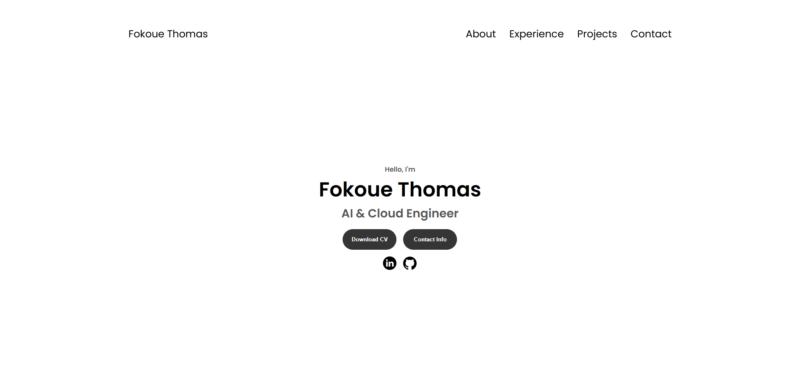

# fokoue-thomas.com - Personal Portfolio

This repository contains my personal portfolio website built and deployed using a modern AWS infrastructure stack.

## Live Website
**Visit my portfolio:** [https://www.fokoue-thomas.com/](https://www.fokoue-thomas.com/)

## Website Preview

## Step-by-Step Deployment Guide

For a detailed, step-by-step guide on how to build and deploy a similar personal website, visit:
**[fokoue-thomas.com-repo](https://github.com/Fokoue22/fokoue-thomas.com-repo.git)**

This guide covers everything from initial setup to full deployment on AWS.

## Architecture & Technologies

This website is built and deployed using:
- **Frontend:** HTML5, CSS3, JavaScript (Vanilla)
- **Version Control:** GitHub
- **Cloud Infrastructure:**
  - **AWS S3** - Static website hosting
  - **AWS CloudFront** - Content Delivery Network (CDN)
  - **AWS Route53** - Domain management & DNS
  - **AWS CodePipeline** - CI/CD automation
  - **AWS Certificate Manager** - SSL/TLS certificates for HTTPS

## Repository Contents
- `index.html` - Main page structure
- `style.css` - Styling (desktop design)
- `mediaqueries.css` - Responsive design (tablet & mobile)
- `script.js` - Interactive components (hamburger menu, etc.)
- `assets/` - Images, icons, and downloadable files

---
*Last Updated: May 2026*